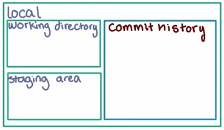

# Chapitre 2. Gestionnaire de versions

## 2.1. CVS

(*Current Version System*)

## 2.2. Subversion

*Amélioration de CVS*.

## 2.3. Mercurial

Similaire à *git*

## 2.4. git

Créé en 2005 par Linus Torvald.

Chaque fichier peut se trouver dans une ou plusieurs des 3 zones suivantes:

- *Zone courante*: contenu actuel de chaque fichier.

- *Zone de transit* (*staging area*): fichiers après ajout (`add`) mais avant soumission (`commit`).

- *Dépôt*: fichier après soumission (`commit`).

### 2.4.1. Configuration

Depuis la ligne de commande:

- Coloration lors de l'affichage des différences:

```bash
$ git config --global color.ui auto
```

- Éditeur par défaut:

```bash
$ git config --global core.editor "/usr/bin/emacs"
```

- ?:

```bash
$ git config --global push.default upstream
$ git config --global merge.conflictstyle diff3
```

- Définir l'adresse e-mail:

```bash
$ git config --global user.email "you@example.com"
```

- Définir le nom d'utilisateur:

```bash
$ git config --global user.name "Your Name"
```

- Activer le *credential helper*:

```bash
$ git config --global credential.helper cache
```

> et pour changer le *timeout* (à 1h):
> 
> ```bash
> $ git config --global credential.helper 'cache --timeout=3600'
> ```

Les mêmes commandes, sans l'option `--global`, n'affectent que la configuration du dépôt courant.

### 2.4.2. Dépôt local



- Créer un nouveau dépôt local depuis le répertoire courant:

```bash
$ git init
```

- cloner un dépôt existant:

```bash
$ git clone depotA/ depotB/
```

- Créer un nouveau dépôt depuis un sous-répertoire d'un premier dépôt:
  
  ```
    $ git clone depotA/ depotB/
    $ cd depotB
    $ git filter-branch --prune-empty --subdirectory-filter <subdir> <branch>
  ```
  
  > Pour enlever ce sous-répertoire de `depotA`
  > 
  > ```bash
  > $ cd ../depotA
  > $ git rm -rf <subdir>
  > $ git commit
  > ```

- Ajouter un fichier dans la zone de transit (*staging area*):

```bash
$ git add chemin/vers/fichier
```

> Il peut s'agir soit d'un nouveau fichier, soit d'un fichier existant mais modifié depuis.

- Enlever un fichier de la zone de transit:

```bash
$ git rm --cached chemin/vers/fichier
```

> Pour le supprimer en même temps:
> 
> ```bash
> $ git rm -f chemin/vers/fichier
> ```

- Soumettre le contenu de la zone de transit vers le dépôt (il s'ensuit l'ouverture automatique de l'éditeur par défaut):

```bash
$ git commit
```

> Chaque soumission se voit attribuée un nombre aléatoire entier sur 20 octets représenté sous la forme de 40 chiffres hexadécimaux.

### 2.4.3. Branche

Chaque branche est associée à un **label**. Celui par défaut s'appelle `master`. 

- Pour connaître la branche courante:

```bash
$ git branch
```

> Pour visualiser la(les) branche(s) distante(s) :
> 
> ```bash
> $ git branch -a
> ```

- Pour créer une nouvelle branche:

```bash
$ git branch <nouveau_label>
```

> -  Pour se placer sur cette nouvelle branche:
>   
>   ```bash
>   $ git checkout <nouveau_label>
>   ```
> 
> - Pour effectuer les 2 opérations en une seule commande:
>   
>   ```bash
>   $ git checkout -b <nouveau_label>
>   ```

- Pour supprimer une branche (uniquement son *label* mais pas les soumissions associées):

```bash
$ git branch -d <label>
```

- Pour visualiser graphiquement les soumissions entre 2 branches:

```bash
$ git log --graph --oneline master <autre_branche>
```

- Pour fusionner une branche (ici `branche2`) dans une autre (ici `branche1`):

```bash
$ git checkout branche1
$ git merge branche2
```

>  Dans le cas où des conflits apparaissent:
> 
> - éditer les fichiers, résoudre les conflits et supprimer les marquages spécifiques.
> 
> - pour annuler une fusion:
>  
>   ```bash
>   $ git merge --abort
>   ```

### 2.4.4. Tag

Permet d'associer un identifiant à une certaine soumission:

- Ajouter un tag sur la branche courante:

  ```bash
  $ git tag -a v1.0
  ```

- Lister les tags

  ```bash
  $ git tag -l
  ```

- Cloner une soumission associée à un *tag*:

  ```bash
  $ git clone <depot> --branch <montag>
  ```

> Les *tags* ne sont pas poussés par défaut sur les dépôts distants. Pour que ce soit le cas:
>
> ```bash
> $ git push --tags
> ```

### 2.4.5. Consultation

- Connaître le numéro de version de `git`:

```bash
$ git --version
```

- Liste tout l'historique (décroissant) des soumissions d'une branche:

```bash
$ git log
```

    - Pour afficher des informations sur la quantité et le type de modifications:
    
    ```bash
    $ git log --stat
    ```
    
    - Pour n'afficher que les 5 dernières soumissions:
    
    ```bash
    $ git log -n 5
    ```

- Pour afficher l'état de modification d'un répertoire:

```
$ git status
```

- Afficher les différences:
  
  - entre 2 soumissions du dépôt:
    
    ```bash
    $ git diff <id1> <id2>
    ```
  
  - entre une soumission et sa parente dans le dépôt:
    
    ```bash
    $ git show <id>
    ```
  
  - entre le répertoire actuel et la zone de transit:
    
    ```bash
    $ git diff
    ```
  
  - entre la zone de transit et le dépôt:
    
    ```bash
    $ git diff --staged
    ```

- Se synchroniser avec le contenu d'une certaine soumission:

```bash
$ git checkout <id>
```

> il est possible de ne taper que les 4 premiers caractères de l'identifiant pour plus de rapidité)

- Pour revenir à la dernière soumission:

```bash
$ git checkout master
```

> Attention: la signification de *checkout* n'est pas la même que dans **svn**.

- Pour annuler toutes les modifications dans le répertoire courant et la zone de transit:

```bash
$ git reset --hard
```

- Quelques erreurs/avertissements lors de l'utilisation:
  
  - *Should not be doing and octopus*: *octopus* est une stratégie de combinaison de plusieurs versions. Ce message indique que la stratégie est utilisée dans une situation non appropriée.
  
  - *You are in 'detached HEAD' state*: *HEAD* correspond à la dernière version. Ceci est un avertissement normal indiquant qu'on ne travaille plus sur la dernière version. 

### ⁠2.4.5. GitHub


C'est un [site Web](https://github.com/) permettant de partager des dépôts git. Son utilisation nécessite la création d'un compte associé à une adresse e-mail:

- gratuit pour la création de dépôts publiques.

- payant pour la création de dépôts privés. 

> Pour s'identifier à l'aide de clés publique/privée ssh:
> 
> 1. Créer une clé pour l'adresse e-mail du compte:
>    
>    ```bash
>    $ ssh-keygen -t rsa -b 4096 -C "snlpdo.fr@gmail.com"
>    ```
>    
>    (sauvegarde dans ~/.ssh/id_rsa-snlpdo)
> 
> 2. Ajouter la clé privée à l'agent ssh:
>    
>    ```bash
>    $ ssh-add ~/.ssh/id_rsa-snlpdo
>    ```
> 
> 3. Ajouter la clé publique au compte **GitHub**: Menu *Settings → SSH and GPG keys → New SSH key*, copier le contenu de la clé publique et cliquer sur <kbd>Add SSH key</kbd>.
> 
> 4. Pour tester le bon fonctionnement:
>    
>    ```bash
>    $ ssh -T git@github.com
>    ```

La synchronisation entre un dépôt local et un dépôt distant sur *GitHub* est manuelle:

- Pour copier un dépôt (local ou distant):
  
  ```bash
  $ git clone <URL>.git
  ```

- Pour créer un nouveau dépôt vide sur *GitHub*, il faut se loguer sur le site, cliquer sur le signe `+` en haut à droite, sélectionner <kbd>New Repository</kbd>, lui donner un nom puis cliquer sur <kbd>Create repository</kbd>.

- Pour associer un nom de dépôt distant au dépôt local:
  
  ```bash
  $ git remote add origin https://….git
  ```

- Pour connaître le dépôt local associé:
  
  ```bash
  $ git remote
  ```
  
  - pour plus d'informations:
    
    ```bash
    $ git remote -v
    ```

- Pour envoyer les nouvelles soumissions du dépôt local sur le dépôt distant:
  
  ```bash
  $ git push <nom_distant> <branche>
  ```

- Pour récupérer les nouvelles soumissions du dépôt distant (dans une branche dédiée) et les fusionner sur le dépôt local:
  
  ```bash
  $ git pull <nom_distant> <branche>
  ```

- Pour uniquement les récupérer (dans la branche dédiée):
  
  ```bash
  $ git fetch <nom_distant>
  ```

- Bifurcation (*fork*): copie d'un dépôt distant de GitHub vers GitHub (avec m-à-j des statistiques et conservation d'un lien). Pour réaliser une bifurcation, il faut cliquer sur le bouton <kbd>Fork</kbd> du dépôt distant source.

- Pour ajouter des collaborateurs à un dépôt distant: cliquer sur <kbd>Settings</kbd> puis <kbd>Collaborators</kbd> et ajouter les identifiants GitHub des personnes. 
